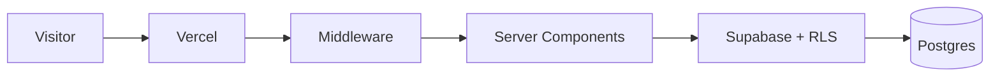

# Production-ready multi-tenant white-label platform for dental clinics.
Enterprise-grade, multi-tenant White-Label SaaS for Dental Clinics. Features atomic onboarding, edge-optimized routing, and strict Supabase RLS isolation.
One codebase → unlimited clinics. Subdomains, custom domains, isolated leads, atomic onboarding.

## Environment Variables
```env
cp .env.example .env.local
NEXT_PUBLIC_SUPABASE_URL=...
NEXT_PUBLIC_SUPABASE_ANON_KEY=...
SUPABASE_SERVICE_ROLE_KEY=...
NEXT_PUBLIC_SITE_URL=http://localhost:3000
NEXT_PUBLIC_PLATFORM_DOMAIN=yourplatform.com
```

## Local Development
```bash
npm install && npm run dev
```
Test tenant: http://localhost:3000/clinic/template

## Database Migrations
```bash
supabase migration new migration_name
supabase db push
```
NEVER edit policies directly in Supabase UI.

## Domain Setup
Add wildcard *.yourplatform.com in Vercel.
Custom domains → point to Vercel + add row to clinics table.

## Onboarding New Clinic
```bash
npm run onboard -- --slug=new-dental --name="Elite Dental" --admin-email=owner@elite-dental.com
```
The CLI validates slug/domain uniqueness, clones template content, invites the clinic admin, binds the profile to `clinic_id`, and rolls back the clinic if the admin step fails.

## Logging & Observability
All public lead inserts go through RPC and are logged in Supabase.

## Architecture

